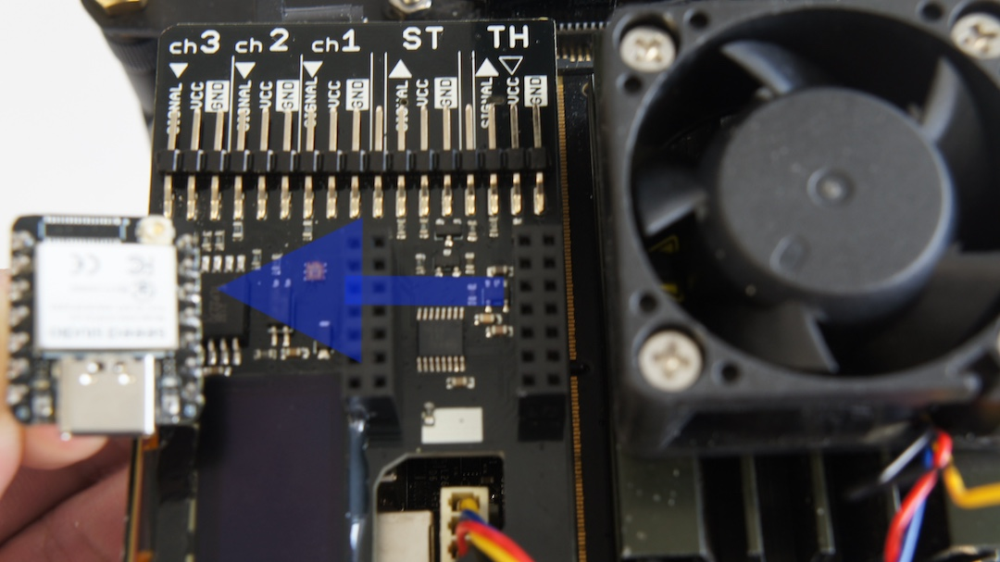
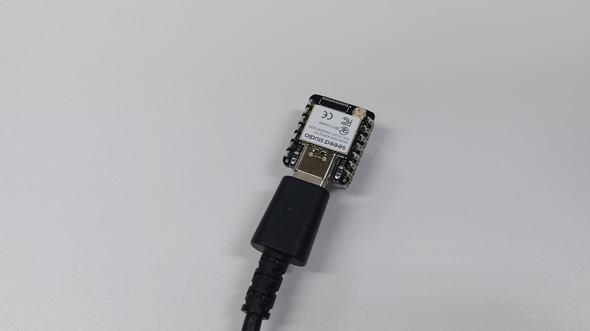
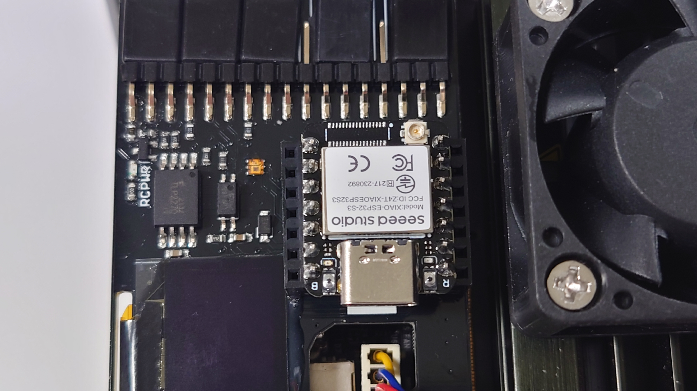

# Firmwareの更新

|Board|
|:--|
|XAIO ESP32S3|

出荷時にXIAOのFirmwareを焼き込み済みですが、アップデートや開発を行う場合は、以下のようにします。

JetsonNanoとRCカーの電源を切って、コントロールボードからマイコンボードを取り出します。



USBtype-Cでパソコンと接続します。



パソコンにArduino IDEがインストールされていない場合は、Arduino IDEをインストールします。

[https://www.arduino.cc/en/software](https://www.arduino.cc/en/software)


Arduino IDEのpreferenceを選択して以下のURLを追記します。

```
https://raw.githubusercontent.com/espressif/arduino-esp32/gh-pages/package_esp32_index.json
```

Arduino IDEのツールからボードマネージャーにてesp32を検索します。

ESP32 Arduinoの最新バージョンをインストールします。

ツールボードからXIAO ESP32S3を選択して以下のサイトのコードをダウンロードします。

[https://github.com/FaBoPlatform/FaBo/tree/master/0612_jetracer/arduino/firmware/Firmware%20_ESP32S3](https://github.com/FaBoPlatform/FaBo/tree/master/0612_jetracer/arduino/firmware/Firmware%20_ESP32S3)

書き込みが終了しましたら、Jetsonの電源が入っていないかを確認し、XIAOを再びコントロール基板に装着します。



以上になります。

