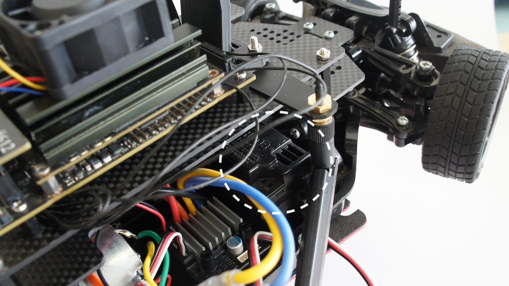
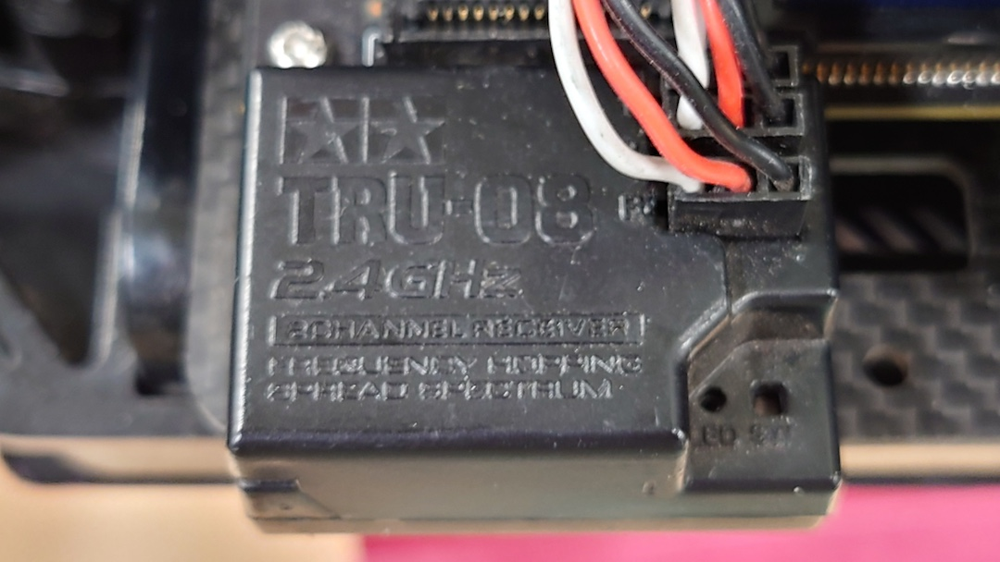
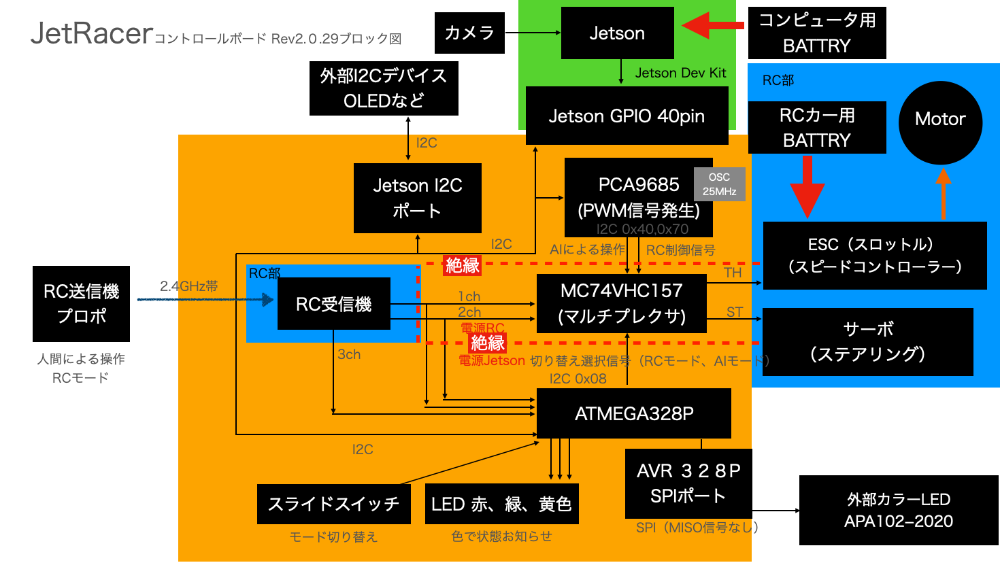
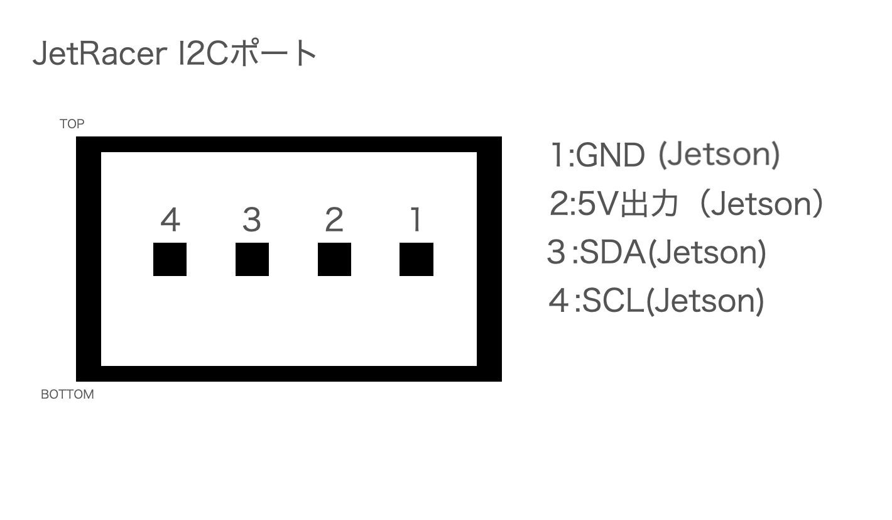
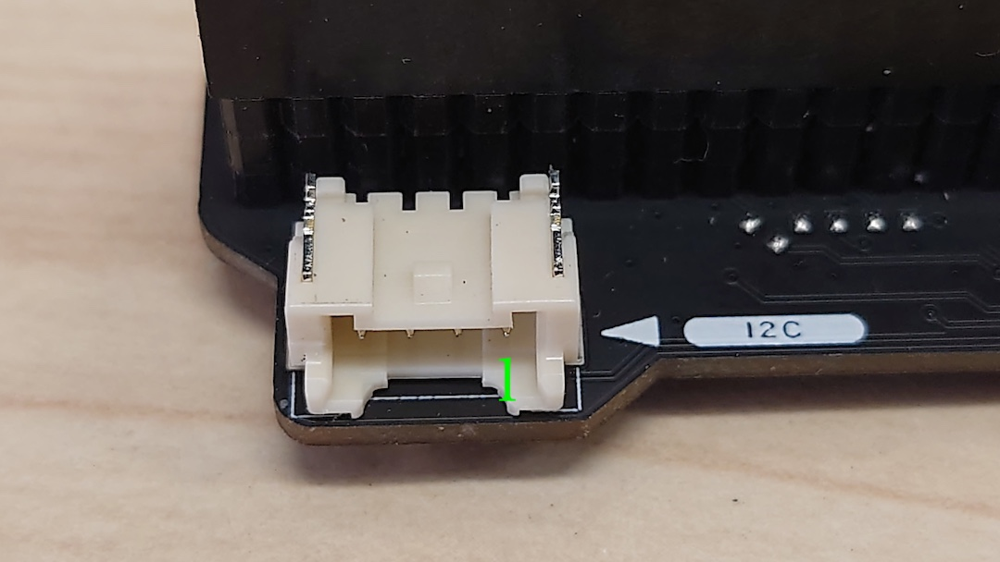
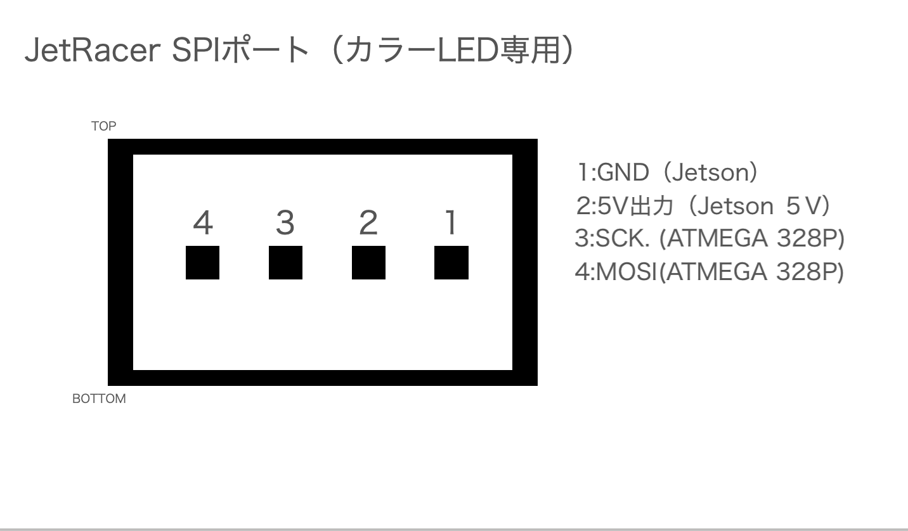
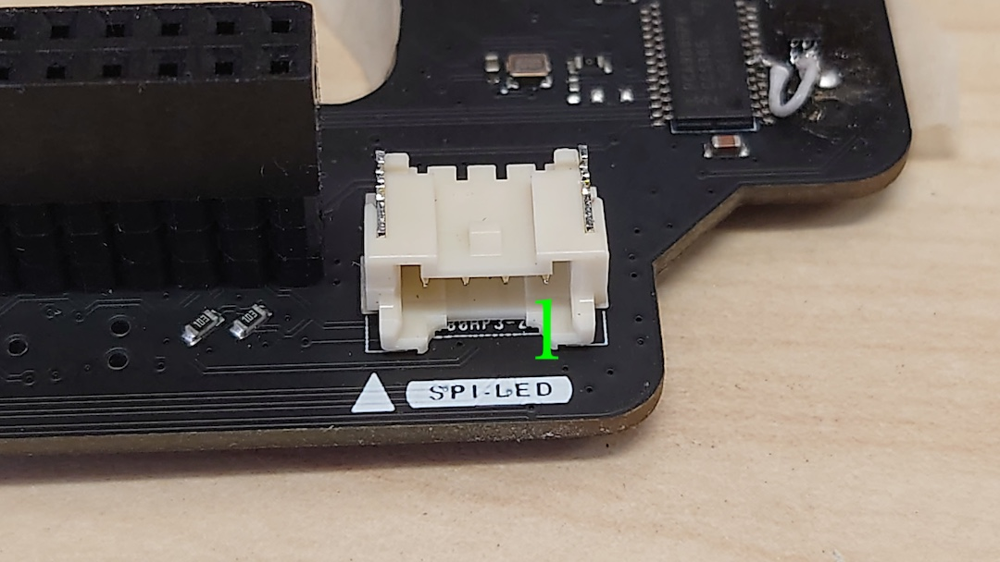
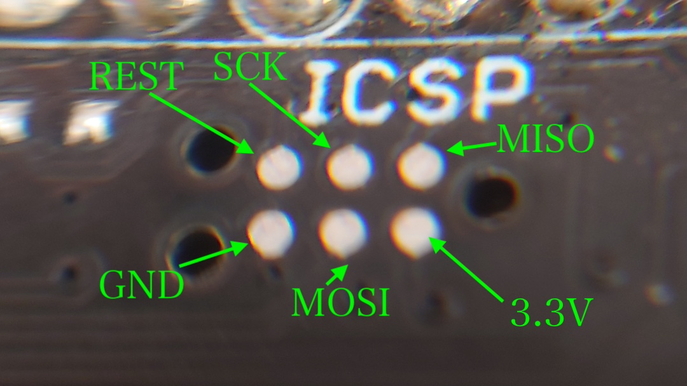

# #612 JetRacerコントロールボード

|Revison|
|:--|
|2.0.28|
|2.0.29|

## 名称と役割


## コントロールボード接続例

JetsonおよびRCカーの電源を停止して、以下のように接続します。

コントロール基板をJetsonの４０ピンヘッダーに接続します。前後、左右ともにズレがないことを確認し、奥までしっかり接続します。

受信機を確認します。車体前方から1ch,2ch,3ch(B)になります。写真の方向の場合は、車体外側が黒（GND）、車体内側が白（信号線）



タミヤTRU-08の場合。上から1ch,2ch,B 　BのBATTは、3chとして使用します。3chのPWM信号波長が１５００ミリ秒未満だった場合は、１５００ミリ秒以上だった場合はAIモードになります。



受信機と３ピンとを繋ぐ、ケーブルが必要となります。

受信機にコネクタを刺し極性を間違いなく接続します。白　SIGNAL、赤　VCC、黒　GND ※弊社３ピンコネクタの場合

サーボからの３ピンのケーブルはSTへ接続、ESCからの３ピンのケーブルはTHに接続します。ズレなくかつ極性を間違えなく接続します。※信号線、極性に関してはそれぞれご使用のサーボまたはESC説明書をご確認ください。

サーボおよびESCからの３ピンコネクタは爪があるので１個空けて接続します

!!!Cation "逆接続に注意"
	３ピンコネクタの逆接続は破損の原因となります。電源投入前に確認しましょう。


## ブロック図



!!!Warnning "GNDに関して"
	RCのGNDとJetsonのGNDは接続されていませんのでご注意ください。

## I/O

GNDは、JetsonとRCカーいずれも共通





※SM04B-PASS-TBT(LF)(SN)使用





※SM04B-PASS-TBT(LF)(SN)使用

ファームウェアの書き換えは、ArduinoのISCPを使用し、Arduino UNOとTag-Connectが必要となります。




## PCA9685の外部水晶発振器について

FaBoのコントロール基板にあるPCA9685のすぐ横に外部の水晶発振器２５MHzがありこちらの発振を使用しますとPCA9685の内部発振器より正確な発振が得られます。

一旦下記のコードを実行すると電源が切れるまで外部発振器が優先され内部発振には設定できません。ご注意ください。

既存のクラスをオーバーライドして組み込みます。

```python
import Fabo_PCA9685

class pca9685CLK(Fabo_PCA9685.PCA9685):
    EXTCLK = 0x40
    def Set_hz(self, hz):
            self.PWM_HZ = hz
            prescale=self.calc_prescale(hz)
            '''
            Hz設定。レジスタに書き込む値はprescaleの値となる
            prescale = calc_prescale(hz)
            '''
            oldmode = self.bus.read_byte_data(self.PCA9685_ADDRESS,self.MODE1)
            newmode = oldmode | self.SLEEP

            # スリープにする
            self.bus.write_byte_data(self.PCA9685_ADDRESS, self.MODE1, newmode)
            #　外部発振を有効化する。(新規追加)
            self.bus.write_byte_data(self.PCA9685_ADDRESS, self.MODE1, self.SLEEP | self.EXTCLK) 
            #周波数を設定
            self.bus.write_byte_data(self.PCA9685_ADDRESS, self.PRE_SCALE, prescale)
            #スリープを解除
            self.bus.write_byte_data(self.PCA9685_ADDRESS, self.MODE1, oldmode)
            time.sleep(self.WAIT_TIME)
            # リスタートする（必須）
            self.bus.write_byte_data(self.PCA9685_ADDRESS, self.MODE1, (oldmode | self.RESTART))  
```

インスタンスのコード

```python
import time
import pkg_resources
import smbus
import time
import json


INITIAL_VALUE = 375
pwm_center = INITIAL_VALUE
pwm_right = INITIAL_VALUE + 100
pwm_left = INITIAL_VALUE - 100
pwm_stop = INITIAL_VALUE


import Jetson.GPIO as GPIO

BOARD_NAME=GPIO.gpio_pin_data.get_data()[0]
if BOARD_NAME == "JETSON_NX":
    print("Jetson Xavier NXを認識")
    I2C_BUSNUM = 8
elif BOARD_NAME == "JETSON_XAVIER":
    print("Jetson AGX Xavierを認識")
    I2C_BUSNUM = 8
elif BOARD_NAME == "JETSON_NANO":
    print("Jetson NANOを認識")
    I2C_BUSNUM = 1

SMBUS='smbus'
BUSNUM=I2C_BUSNUM
SERVO_HZ=60
bus = smbus.SMBus(BUSNUM)
PCA9685 = pca9685CLK(bus,INITIAL_VALUE,address=0x40)
PCA9685.Set_hz(SERVO_HZ)
```

!!!Cation "電圧レベル"
	本基板から出力されるPWMの電圧レベル(ST,TH)はBEC電圧になります。（約６V前後）