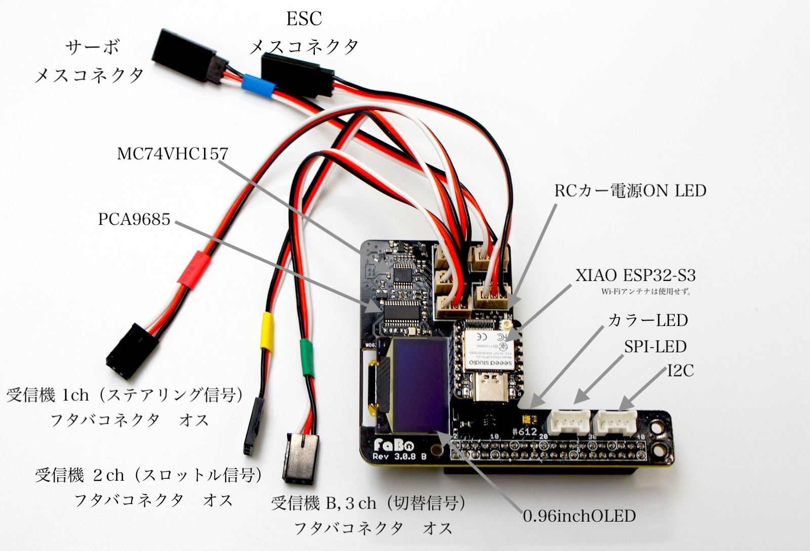
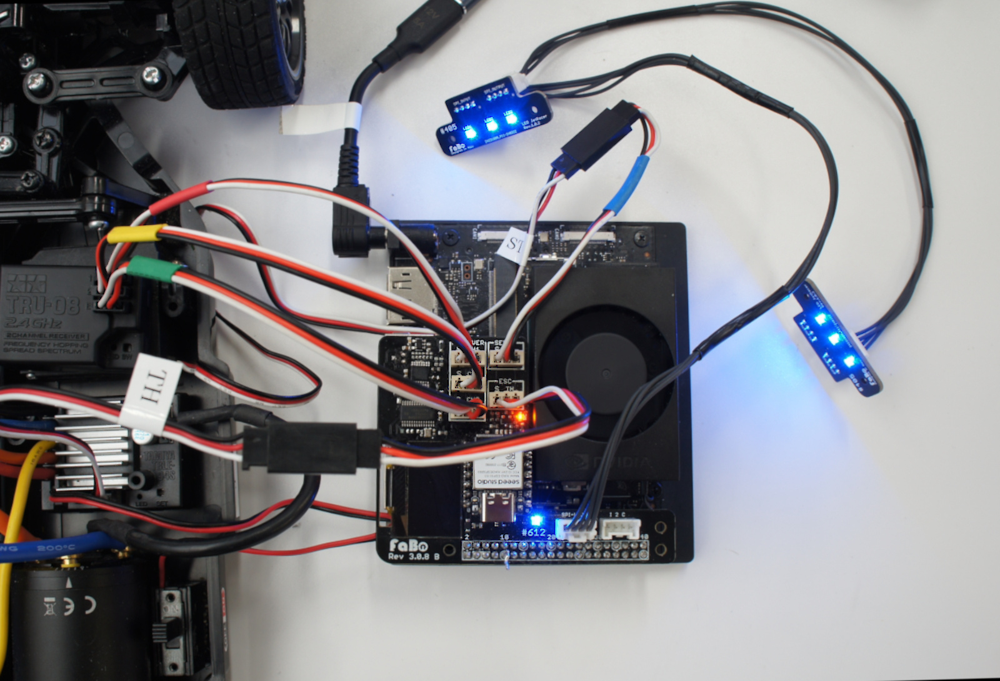
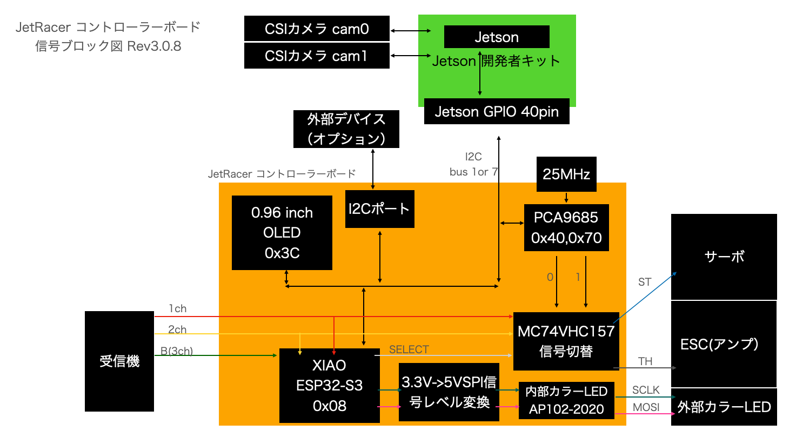
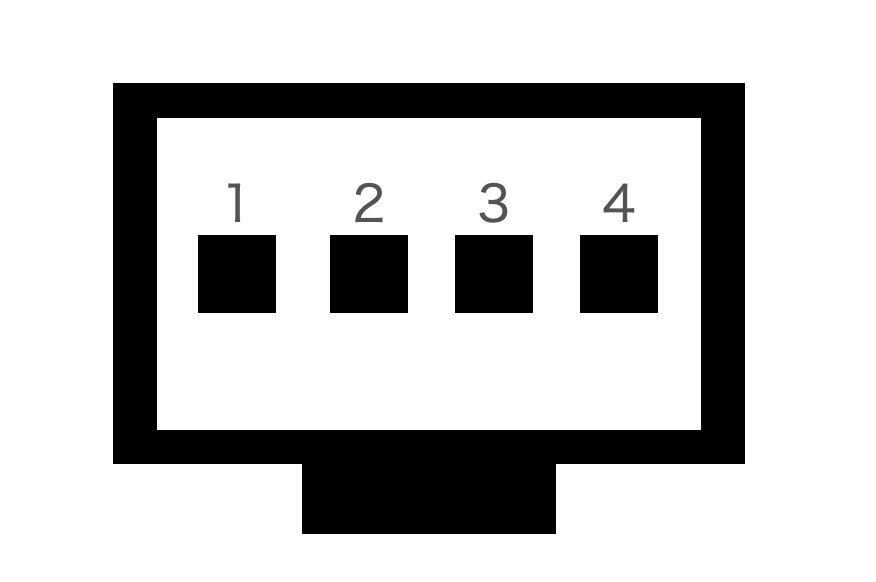
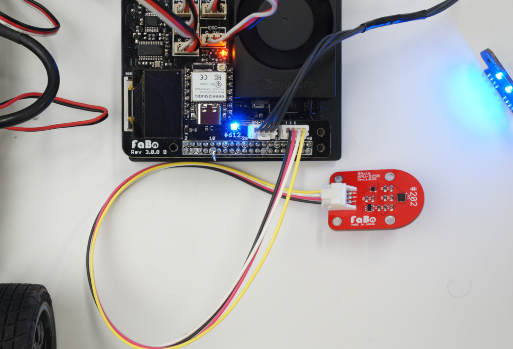
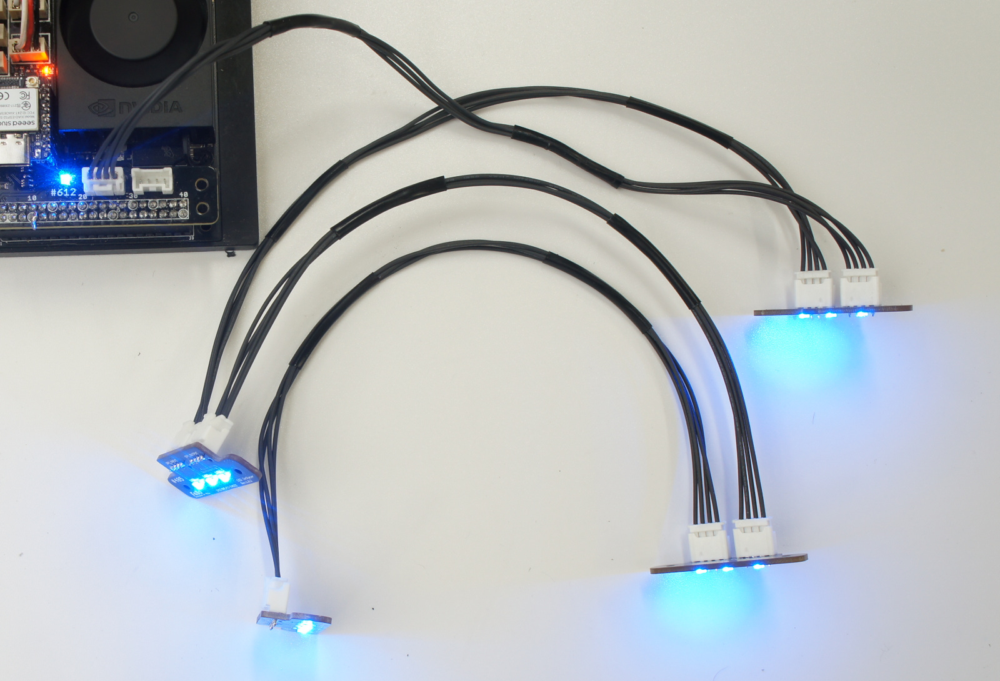
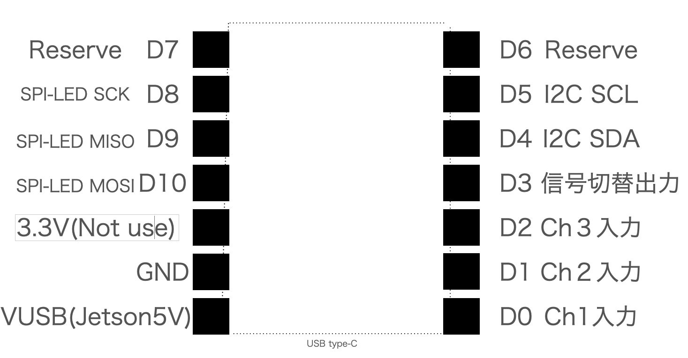

# #612 JetRacerコントロールボード

|Model Number|Revison|Description|
|:--|:--|:--|
|---|3.0.8|Jetson Orin Nano専用|
|JRB-CB3|3.0.8 B|Jetson Nanoに対応|

## Rev3.0.4と主な変更点

### 追加

 RCカーが電源ON時に、マルチプレクサへの信号を停止機能追加。

### 変更

受信機、サーボおよびESCの接続、逆接続防止のケーブルコネクタに変更。

### 削除

ブラシレスモータのセンサーを回転数計測削除。

９軸センサーBNO055を削除。


## 動作環境

Jetson Orin Nano 8GB 開発者キット　および Jetson Nano　4GB開発者キット

JetRacerコントロールボード Rev2.0.21,Rev2.0.23,Rev2.0.28,Rev2.0.29にある固定する切り替えスイッチがありません。必要に応じてお客様が追加でファームウェアを変更し切り替えてください。

マイコンボードのファームウェアは焼き込み済みです。XIAOのWi-Fiアンテナは使用しません。

ファインスペック2.4G 電動RCドライブセット（45053）のみ動作確認済み。ただし、受信機とESCが一体型になっているモデルは、使用不可。

## 名称と役割



### コントロール基板のオレンジ色LED

RCカーの電源がONになった時は、コントローラーボードにあるオレンジ色のLEDが発光します。RCの電圧レベルが低下した時、暗くなります。

### コントロール基板カラーLED

|カラーLED 色|　状態　|
|:--|:--|
|ブルー|受信機から信号がない|
|グリーン|プロポ操作可能|
|マゼンタ|自動走行可能|

### XIAO ESP32-S3

脱着可能です。ファームウェアは焼き込まれています。ファームウェア書き換え時は取り外してファームウェアを更新してください。

Version 1.1.5(Release 2024/12/25)

[https://github.com/FaBoPlatform/FaBo/tree/master/0612_jetracer/arduino/firmware/Firmware%20_ESP32S3/esp32s3](https://github.com/FaBoPlatform/FaBo/tree/master/0612_jetracer/arduino/firmware/Firmware%20_ESP32S3/esp32s3)

### 各コネクタ

受信機、ESC,サーボ取り付けはつめがあるのに対しては逆接続は防げますが、爪のないコネクタは防げません。ご注意ください。

## コントロールボード接続例

受信機の接続　受信機１の場合は、基板１ch、受信機２の場合は、基板２ch、受信機Bの場合は、基板３ch。

サーボとの接続は、基板Servo、ESCとの接続は基板ESCに接続します。4pinコネクタを使い、#405 JetRacer LEDの接続は、基板SPI-LEDコネクタに接続します。ドーターであるLED基板の方をINPUT側に接続します。




!!!Cation "ズレて接続に注意"
	コントロール基板とJetsonを接続するときは、ズレて挿入していないか確認してから電源を入れましょう。故障の原因となります。

!!!Cation "逆接続に注意"
	サーボ変換ケーブルまたは、爪のないサーボケーブルご使用で、３ピンコネクタの逆接続は破損の原因となります。電源投入前に確認しましょう。

!!!Cation "基板接続の注意"
	コントロール基板の受信機のオスコネクタとコントロール基板のESCメスコネクタまたはサーボメスコネクタ通しの接続は故障の原因となりますのでご注意ください。

## ブロック図



## I/O

GNDは、JetsonとRCカーいずれも共通

### I２Cポートピンアサイン


※B04B-PASK-1使用

|Pin Number|Function|Description|I/O|
|:--|:--|:--|:--|
|1|GND|Common|Ground|
|2|VCC|Jetson Power(5V)|Power|
|3|SDA|Jetson I2Cデータ(3.3V)|I/O|
|4|SCL|Jetson I2Cクロック(3.3V)|I/O|

＊I２Cのバス番号はJetson Nanoは１、Jetson Orin　Nanoは７

FaBo i2c Brick ９軸加速度センサーを使用した例



### SPI-LEDポートピンアサイン


※B04B-PASK-1使用

|Pin Number|Function|Description|I/O|
|:--|:--|:--|:--|
|1|GND|Common|Ground|
|2|VCC|Jetson Power(5V)|Power|
|3|CLK|XIAO ESP32-S3 SCK(5V)|OUTPUT|
|4|DATA|XIAO ESP32-S3 MOSI(5V)|OUTPUT|

FaBo \#405 JetRacer LEDを複数接続。



### ESP32-S3コネクタのピンアサイン



!!!Cation "XIAO接続"
	取り付け方法をお間違えなくようにご確認ください。


!!!Cation "電圧レベル"
	本基板から出力されるPWMの電圧レベル(ST,TH)は3Vレベルになります。

!!!Cation "GNDに関して"
	本基板は、JetsonのGNDとRCカーのGNDは接続されております。


## PCA9685の外部水晶発振器について

FaBoのコントロール基板にあるPCA9685のすぐ横に外部の水晶発振器２５MHzがありこちらの発振を使用しますとPCA9685の内部発振器より周囲温度環境に影響を受けにくい正確な発振が得られます。

このことによりステアリング量、スロットル量が安定化します。また、スロットルの中央値も安定化することにより車体にブレーキ信号からバック信号へ切り替えが容易になります。

一旦下記のコードを実行すると電源が切れるまで外部発振器が優先され内部発振には設定できません。ご注意ください。

###サンプルコード

Fabo_PCA9685クラスをオーバーライドして組み込みます。

```python
import Fabo_PCA9685

class pca9685CLK(Fabo_PCA9685.PCA9685):
    EXTCLK = 0x40
    def Set_hz(self, hz):
            self.PWM_HZ = hz
            prescale=self.calc_prescale(hz)
            '''
            Hz設定。レジスタに書き込む値はprescaleの値となる
            prescale = calc_prescale(hz)
            '''
            oldmode = self.bus.read_byte_data(self.PCA9685_ADDRESS,self.MODE1)
            newmode = oldmode | self.SLEEP

            # スリープにする
            self.bus.write_byte_data(self.PCA9685_ADDRESS, self.MODE1, newmode)
            #　外部発振を有効化する。(新規追加)
            self.bus.write_byte_data(self.PCA9685_ADDRESS, self.MODE1, self.SLEEP | self.EXTCLK) 
            #周波数を設定
            self.bus.write_byte_data(self.PCA9685_ADDRESS, self.PRE_SCALE, prescale)
            #スリープを解除
            self.bus.write_byte_data(self.PCA9685_ADDRESS, self.MODE1, oldmode)
            time.sleep(self.WAIT_TIME)
            # リスタートする（必須）
            self.bus.write_byte_data(self.PCA9685_ADDRESS, self.MODE1, (oldmode | self.RESTART))  
```

続いてインスタンスのコード

ステアリングの中央値は車体ごとにエンドポイントを調整します。

```python
import time
import pkg_resources
import smbus
import time
import json


INITIAL_VALUE = 375
pwm_center = INITIAL_VALUE
pwm_right = INITIAL_VALUE + 70
pwm_left = INITIAL_VALUE - 70
pwm_stop = INITIAL_VALUE


import Jetson.GPIO as GPIO

BOARD_NAME=GPIO.gpio_pin_data.get_data()[0]
if BOARD_NAME == "JETSON_NX":
    print("Jetson Xavier NXを認識")
    I2C_BUSNUM = 8
elif BOARD_NAME == "JETSON_XAVIER":
    print("Jetson AGX Xavierを認識")
    I2C_BUSNUM = 8
elif BOARD_NAME == "JETSON_NANO":
    print("Jetson NANOを認識")
    I2C_BUSNUM = 1

SMBUS='smbus'
BUSNUM=I2C_BUSNUM
SERVO_HZ=60
bus = smbus.SMBus(BUSNUM)
PCA9685 = pca9685CLK(bus,INITIAL_VALUE,address=0x40)
PCA9685.Set_hz(SERVO_HZ)
```
