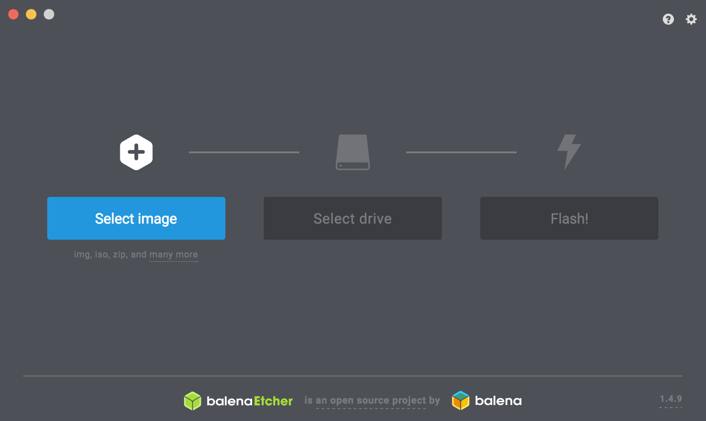

# SDカードの作成

!!! Info
	本ドキュメントはJetson Nano 4GBのみ対応しています

## SDカードのイメージ　

FaBo #612搭載JetRacer向けのSDカードイメージをダウンロードします。 
FaBo #612 Rev 2.0.9以降はOLEDを搭載しています。 

|JetPackバージョン|ダウンロード|
|:--|:--|
|JetPack 4.4|[jetracer_2020_07_10_jp44.zip](https://drive.google.com/file/d/1ekSFgQlHiUE6Jf_bwHlOUb2_zwOS98t1/view?usp=sharing)|

## SDカードの焼き込み

SDカードのイメージは、[Etcher](https://www.balena.io/etcher/)を用いて、SDカードに焼き込みます。

