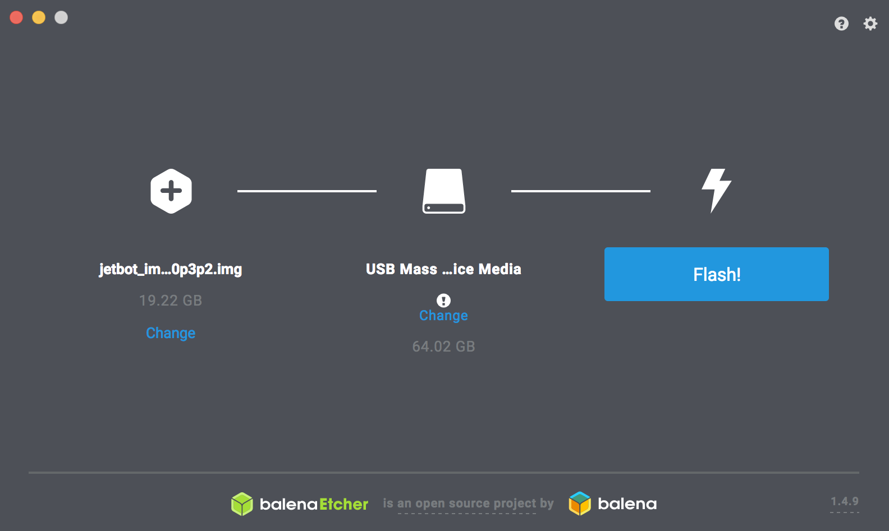

# SDカードの焼込

!!! Warning
	FaBo Storeより、JetRacer Kitをご購入の方は、付属SDカードにJetPack4.6及びJetCardを焼き込み済みです。

!!! Info
	本ドキュメントはJetson Nano 4GBのみ対応しています

# SDカードの作成

!!! Warning
	FaBo Storeより、JetRacer Kitをご購入の方は、ダウンロード不要です。（一部のモデルを除く）

もし、SDカードイメージをダウンロードしたい方は、こちらからダウンロードお願いいたします。

|  対象  |  JetPack  | リンク先  |
|:-----------|:------------|:------------|
|  FaBo JetRacer Kit  |Jetpack4.6|  [jetracer-nano-4gb-jp46_20211229.zip](https://drive.google.com/file/d/1ks6qTfVko-3pTnjwTUBr4cYIbWriUZyO/view?usp=sharing)|

※SDカードのサイズは、６４GBかつ高速なものを推奨します。

ダウンロード後は、ZIPファイルを解凍して、[barenaEtcher](https://www.balena.io/etcher/)を使用しイメージファイルをSDカードに焼きます。

!!! Warning
	上記のダウンロードからSDカードを焼き込んだ場合は、JetPack4.6はインストール済みですので、以下ののダウンロードおよびインストールは不要です。

## JetPack4.6ベースでのSDカードの作成

!!! Warning
	ここからは、JetPack SDK 4.6をダウンロードし、JetCardのインストール作業になります。付属のSDカードをご使用の方、及び上記でSDカードをダウンロードし作成済みの方は作業不要です。
	
!!! Warning
	FaBo Storeより、JetRacer Kitをご購入の方は、SDカード作成不要です。（一部のモデルを除く）

NVIDIA社の[JETPACK SDK](https://developer.nvidia.com/embedded/jetpack)のページよりJetPack4.6イメージ（For Jetson Nano Developer Kit）をダウンロードし、解凍します。そのイメージファイルをSDカードに焼き込みます。

※SDカードは64GBをおすすめします。

※ダウンロードファイルは、JETSON XAVIER NX,Jetson 2GBとお間違えのないようにご確認ください。

SDカードのイメージは、[Etcher](https://www.balena.io/etcher/)を用いて、SDカードに焼き込みます。

Select Image をクリックし、ダウンロードしたファイルを選択します。

Select driveをクリックします。

書き込みたいSDカードが挿入されているドライブを選択します。

Flashをクリックすると焼き込みが始ります。

