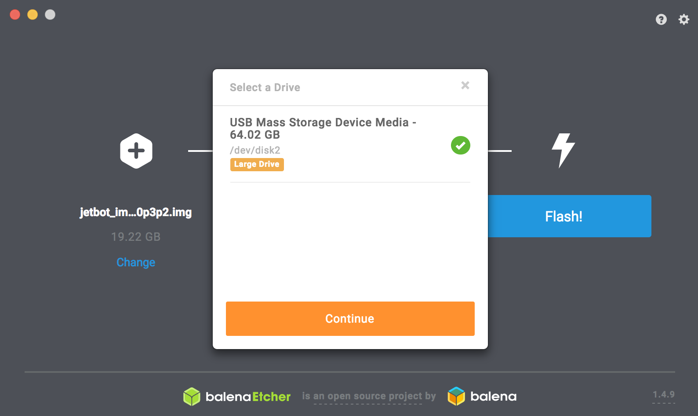

# SDカードの作成

!!! Warning
	FaBo Storeより、JetRacerを購入の方は、付属SDカードにJetPack4.6を焼き込み済みです。

!!! Info
	本ドキュメントはJetson Nano 4GBのみ対応しています

## JetPack4.6ベースでのSDカードの作成

NVIDIA社の[JETPACK SDK](https://developer.nvidia.com/embedded/jetpack)のページよりJetPack4.6イメージをダウンロードし、SDカードに焼き込みます。

SDカードは64GBをおすすめします。

SDカードのイメージは、[Etcher](https://www.balena.io/etcher/)を用いて、SDカードに焼き込みます。

