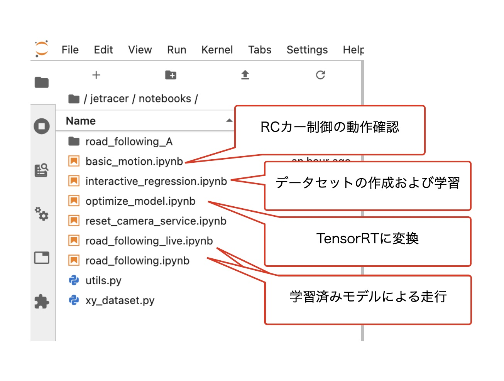

# Notebooks

## 使用するNotebooks

## 流れ

|順番|notebooks|内容|
|:--|:--|:--|
|1|basic_motion.ipynb|RCカー制御をJetsonからおこなうテスト|
|2|interactive_regression.ipynb|データセットの作成と学習|
|3|optimize_model.ipynb|学習済みモデルのTensorRTへの変換(高速化, 軽量化)|
|4|road_following_live.ipynb|デモ走行(画面付き)|
|4|road_following.ipynb|デモ走行(画面なし)|

