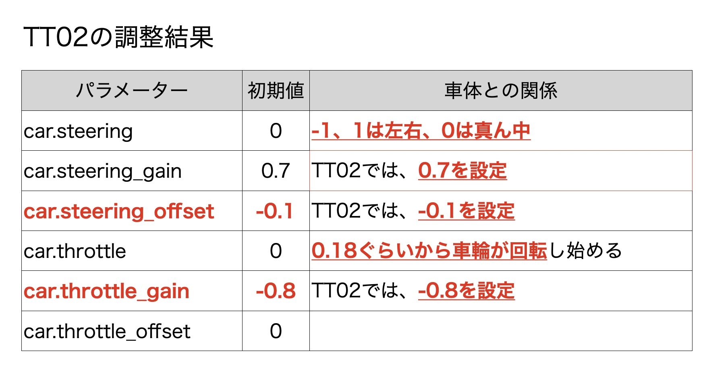

# Basic motion

`basic_motion.ipynb`では、RCカーが問題なく制御できるかの確認をおこないます。

## 解説動画




## ステアリング

`car.steering`が前輪のステアリングの値になります。-1〜1の間の値が設定可能です。

```python
car.steering = 0.3
```

左にいっぱいタイヤを切る

```python
car.steering = 1
```

右にいっぱいタイヤを切る

```python
car.steering = -1
```

中央位置に戻す

```python
car.steering = 0
```

ここで、左右にいっぱいにタイヤが切れない場合は調節が必要です。

|値|内容|用途|
|:--|:--|:--|
|car.steering_gain| キレ角の調整 | 切れすぎる時、切れなすぎる時に調整 |
|car.steering_offset| オフセット| 前輪の初期値が曲がっている場合に調整 |

## スロットル

ここでは、スロットルが動きますので、車輪を浮かせた状態にしていてください。

```python
car.throttle = 0.0
```

ここの値も1〜-1の間が設定可能です。

0.2程度の値を設定して、タイヤが回るかを確認してみましょう。

```python
car.throttle = 0.2
```