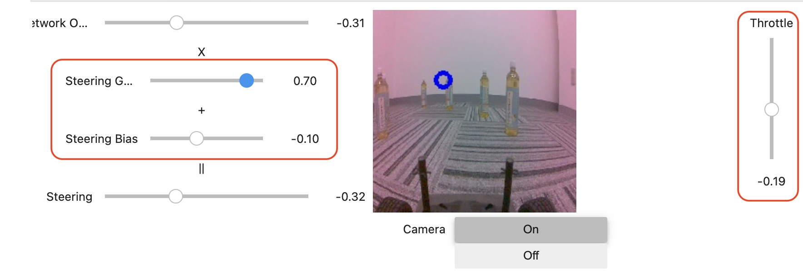

# 走行

## 走行のためのNotebook

走行で使えるnotebookは、`road_following.ipynb`と`road_following_live.ipynb`の２つが存在しています。

|Notebook|内容|
|:--|:--|
|road_following|映像を表示せずに、デモ走行|
|road_following_live|映像が転送され映像を確認しながらデモ走行(映像転送遅延に注意)|


## road_following_live

road_following_liveは、映像を見ながら、走行が可能です。映像遅延が発生する場合は、うまく走行できない場合もあるので、認識の確認等での用途で使用する感じになります。



## カメラの終了

下記処理をNotebookに追加して、必ず実行してください。実行しないと、interactive_regressionでカメラの読み込み時に、エラーが発生します。

```python
import time
camera.running = False
time.thread(0.1)
camera.cap.release()
```

## road_following

road_followingは初期のjetracerから提供されている走行用のnotebookです。TensorRTに変換された学習済みモデルにカメラ映像を流し込み、steeringの角度を推論します。各種値は、`STEERING_GAIN`,`STEERING_BIAS`等で調整します。`04_road_following.ipynb`では、バイアス、ゲインは、タミヤRCカー向けに調整済みです。

```python
from utils import preprocess
import numpy as np

while True:
    image = camera.read()
    image = preprocess(image).half()
    output = model_trt(image).detach().cpu().numpy().flatten()
    x = float(output[0])
    car.throttle = -1.0 * throttle_slider.value - 0.1
    car.steering = x * steering_gain_slider.value + steering_bias_slider.value
    steering_value_slider.value = car.steering
```

## カメラの終了

下記処理をNotebookに追加して、必ず実行してください。実行しないと、interactive_regressionでカメラの読み込み時に、エラーが発生します。

```python
import time
camera.running = False
time.thread(0.1)
camera.cap.release()
```


