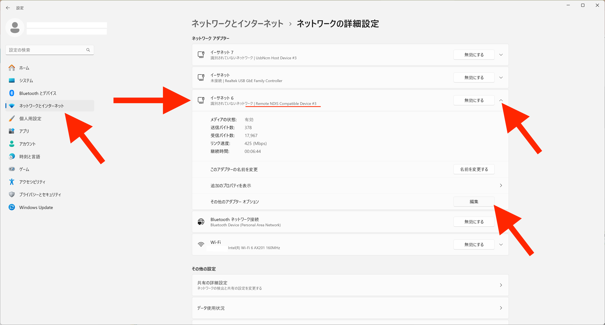
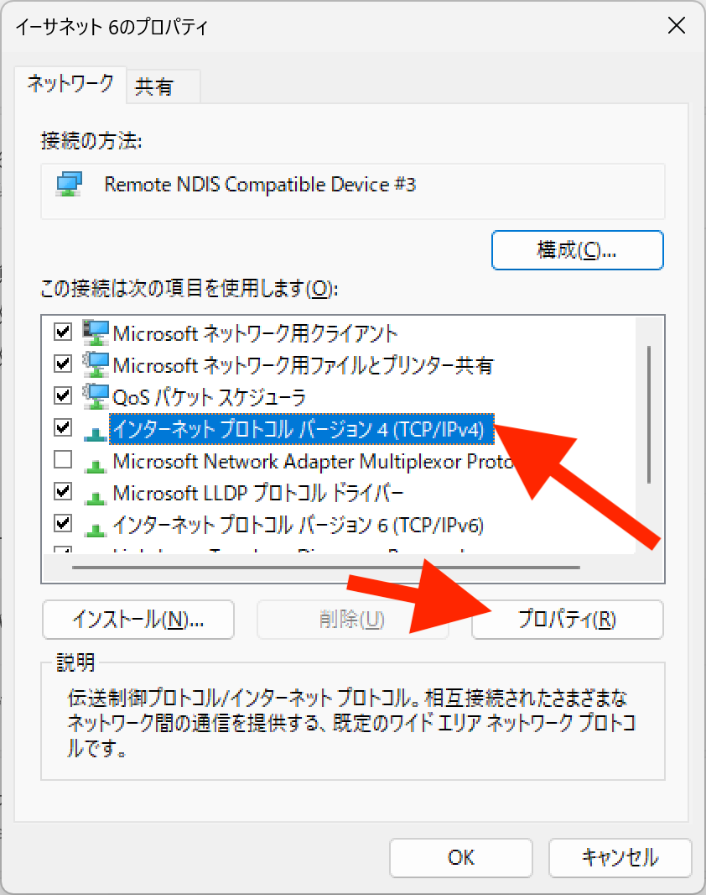
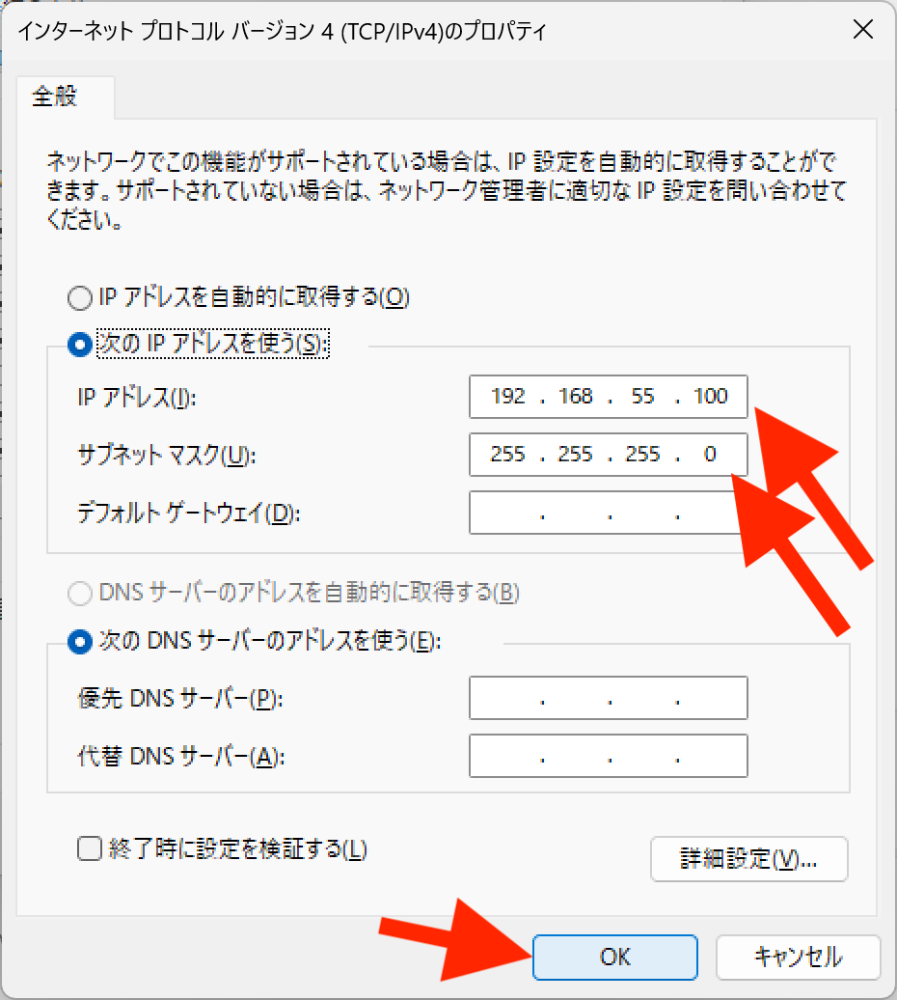

# 接続できない対処方法

## Windos環境においてマイクロUSBでJetsonNanoに接続できない

一部のWindowsの機種でUSBマイクロでの接続が間欠で途切れることを確認しております。

その場合は、PCに静的なIPアドレス(192.168.55.100)を設定します。

Windowsボタン＞設定＞ネットワークとインターネット>ネットワークの詳細設定

ネットワークアダプタの欄にあるRemote NDIS Compatible Deviceがあるデバイスを選択して↓を押して編集ボタンを押します。

インターネットプロトコルバージョン４（TCP/IPv4)を選択してプロパティボタンを押します。

IPアドレスは、192.168.55.100とサブネットマスクは255.255.255.0と入力いたします。

OKボタンを押します。
